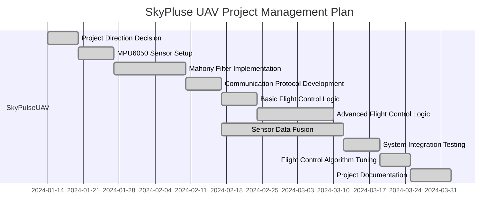
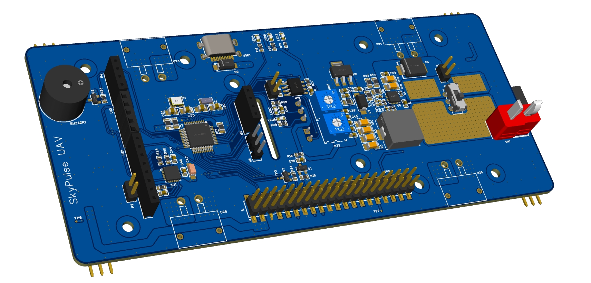

<div align="center">
    
    <p>
      <i align="center">Pioneering UAV Technology for Critical Missions 🚀</i>
    </p>
    <div id="badges">
     <a href="your-youtube-URL"></a>
     <a href="https://twitter.com/Antonio_Btian"></a>
     <a href="GitHub License"></a>
     <a href="Contributions welcome"></a>
     <a href="https://github.com/Tony-Btian/SkyPulseUAV/issues"></a>
     <a href="https://github.com/Tony-Btian/SkyPulseUAV"></a>
     <a href="https://github.com/Tony-Btian/SkyPulseUAV"></a>
    </div>
</div>


# SkyPulseUAV Introduction
:star: Star us on GitHub — It motivates us a lot!

SkyPulseUAV is a groundbreaking real-time embedded system project, specifically designed to enhance the capabilities of unmanned aerial vehicles (UAVs) in critical scenarios such as fire detection, earthquake rescue, and terrain exploration. Our mission is to empower UAVs with unparalleled stability and precision, making them indispensable tools in emergency response and environmental analysis.

### Project Highlights
- **Versatile Application Spectrum**: Optimized for high-stakes missions like fire detection, earthquake relief efforts, and comprehensive terrain surveys.
- **Real-Time Decision Making**: Features real-time data processing for immediate and accurate responses in dynamic environments.
- **Advanced Stability and Control**: Employs sophisticated algorithms to maintain UAV balance and maneuverability, even in adverse conditions.
- **Seamless Hardware Integration**: Designed for compatibility with diverse UAV platforms, enhancing their utility in various field applications.
- **Open Source Community Driven**: SkyPulseUAV thrives on collaborative innovation, inviting contributions from developers, engineers, and UAV enthusiasts worldwide.

# Table of contents[](#table-of-contents)
- [Project Development Planning](#project-development-planning)
- [General Guide](#general-guide)
    - [System Deployment on Raspberry Pi](#system-deployment-on-raspberry-pi)
    - [System Deployment on Ubuntu](#system-deployment-on-ubuntu)
    - [Source Code Directory Descriptions](#source-code-directory-descriptions)
    - [Hardware Preparation](#hardware-preparation)
- [Hardware Development Guidance](#hardware-development-guidance)
    - [Hardware Components](#skypulseuav-hardware-components)
    - [Sensors & Actuators](#sensors--actuators)
    - [Motherboard](#skypulseuav-motherboard)
- [Software Development Guidance](#software-development-guidance)
    - [SkyPulseUAV Communication Protocol]()
- [Contributors](#contributors)
- [License](#license)
- [Thank you all!](#thank-you-all)


# Project Development Planning
#### Global
- [x] Build up the GitHub warehouse & README
- [x] Complete the basic environment development for the project by installing the Raspbian OS for Raspberry Pi
- [x] Design the Hardware and Software
- [x] Buy electrical components for the project

#### Binhan Tian
- [x] Pitching Day Presentation
- [x] Motherboard Schematic Design: Power, STM32 Mini System
- [x] Motherboard PCB Layout
- [x] FCS I2C Driver Class Coding
- [x] SkyPulse GroundStation C++ Code Development & UI Design
- [x] Module Driver Development

#### Jianliang Wu
- [x] C++ code on Raspberry Pi
- [x] Debugging sensors to make them work properly and perfectly
- [x] Deploy Mahony filter algorithm to fuse data from gyroscope and accelerometer
- [x] Design the control algorithm and tune the PID parameters
- [x] Create easy-to-use cross-compile environment for users
- [x] STM32 Development

#### Jiaxing Wang


#### Shilin Zhang
- [x] Buy Needed Hardware Module: BMP180, MPU6050
- [x] Motherboard Schemic Design: Port, RF Module
- [x] Wiki Documentation
- [x] Update the README Document (Synchronized with the Development Process)
- [x] Synchronously update the contents of README_ZH.md & README.md (once a week)

#### Zhiyan Tong


### Visual Project Management Plan

If you can not see the text inside, please switch your brower to light mode.



# General Guide


### 1. Source Code Directory Descriptions

- Hardware
- SkyPulse_Device
- SKyPulse_FCS
- SkyPulse_GroundStation

#### 1.1. Hardware
>Developer: Binhan Tian & Shilin Zhang

Motherboard's hardware design files are stored in the directory. 
- SkyPulseUAV Motherboard Schematic
- SkyPulseUAV Motherboard PCB
- Motherboard BOM List
- Hardware Design Guide

#### 1.1. SkyPulse_FCS

The SkyPulse_FCS directory contains code customized specifically for the Qt environment. The code base includes the user interface and back-end logic. The focus of this folder is to provide a front-end control system that compiles and runs on a Raspberry Pi, utilizing Qt's graphical and system management capabilities to provide a powerful user experience and system control.

To compile and run the software in this directory, do the following
- Ensure that Qt is installed on the Raspberry Pi or development machine.
- Use Qt Creator to open the project file and compile the code.
- Deploy the application to the Raspberry Pi for testing and production.

#### 1.2. SkyPulse_Device

The SkyPulse_Device catalog contains code that can be edited and compiled directly using Visual Studio. The code is designed to interact with hardware devices and manage device operations. It is designed to run efficiently on a Raspberry Pi, providing the backend logic needed to control all aspects of device functionality. The code structure in this folder supports easy maintenance and scalability, utilizing Visual Studio's powerful development tools to ensure high performance and reliability.

The steps to compile and run software from this directory include
- Open the project in Visual Studio.
- Compile the code to ensure there are no errors.
- Transferring the executable to the Raspberry Pi and executing it to handle device-specific operations.

#### 1.3. SkyPulse_GroundStation

The SkyPulse GroundStation directory contains the ground control station software developed for Ubuntu systems. This application acts as a control terminal that integrates functionalities from both the SkyPulse_FCS and SkyPulse_Device programs, providing a comprehensive interface for managing and operating unmanned aerial vehicles (UAVs).
- Control Interface: Offers a user-friendly graphical interface on Ubuntu for interacting with UAVs.
- Communication: Utilizes both TCP and UDP protocols to ensure reliable and real-time communication with the UAVs.
- Integration: Seamlessly combines commands and controls from the FCS and device software, offering a unified operation console for all flight and hardware management tasks.

To get the SkyPulse GroundStation up and running on an Ubuntu system:
- Ensure all dependencies are installed. This may include libraries and tools specific to network communication and graphical user interface development.
- Compile the source code using a suitable C++ compiler or an integrated development environment (IDE) that supports C++ projects.
- Execute the compiled application. Ensure the network settings are configured to match the communication parameters of the UAVs.
This directory is essential for operators and developers who need to control and monitor UAVs directly from a ground-based station, providing all necessary tools and interfaces for effective mission management.

System Deployment on Ubuntu
#### 1.1. Hardware and Software Clarification
- Raspberry Pi: Raspberry Pi 4B (8GB), with Raspberry OS 64 bit
- Linux Distribution: Ubuntu Desktop 22.04.04 LTS
- G++ Version: g++ (Debian 12.2.0-14) 12.2.0
- GCC Version: gcc (Debian 12.2.0-14) 12.2.0

#### 1.2. Environment Setup
1. [Raspberry Pi Imager](https://www.raspberrypi.com/software/) : Install Raspberry Pi OS using Raspberry Pi Imager
2. Use Raspberry Pi Image to burn the image to an SD card


> [!TIP]
> Set Up the User name, Password, and SSH Connection setting using Raspberry Pi Imager. This eliminates the need to utilize a mouse and keyboard to operate the Raspberry Pi.

3. Run the setup script, which takes care of installing dependencies, building packages
```
sudo apt-get update
sudo apt-get upgrade
sudo apt-get install gcc g++ git
```

### 2. System Deployment on Ubuntu
1. Download the QT software from the [official website](https://qt.io/download).
2. Install QT by running
```
chmod +x qt-unified-linux-x64-*.run
```
Run the installation process
```
./qt-unified-linux-x64-*.run
```
Installing QT libraries
```
sudo apt update
sudo apt install qt5-default
sudo apt install qtmultimedia5-dev qtwebengine5-dev
```
Cross-compile the Raspberry Pi using QT according to the following [Tutorial](https://wiki.qt.io/Cross-Compile_Qt_6_for_Raspberry_Pi).

### 3. Source Code Directory Descriptions


# Hardware Development Guidance

### Hardware Components
- Drone Fuselage
- Brushless Motor
- ESC
- Motherboard
- Battery
- Propeller
#### ESC
## Sensors & Actuators

#### The list of used sensors is shown in Table 2.1.  Materials (BOM)
| Item | Component Name | Part Number | Description                                 | Quantity | Supplier          | Notes               |
|:----:|:--------------:|:-----------:|:-------------------------------------------:|:--------:|:-----------------:|:-------------------:|
|  1   | Barometer      | BMP180      | Atmospheric pressure and temperature sensor | 1 (pcs)  | Chip Supplier     | Altitude positioning|
|  2   | IMU Module     | MPU6050     | 3-axis gyroscope + 3-axis accelerometer     | 1 (pcs)  | Module Supplier   | Attitude control    |
|  3   | Compass        | GY-271      | Three-axis magnetic field sensor            | 1 (pcs)  | Chip Supplier     | Heading determination|
|  4   | Infrared Sensor| IR-SEN      | Short-range obstacle detection              | 4 (pcs)  | Sensor Supplier   | Collision avoidance |
|  5   | Ultrasonic Sensor| US-SEN    | Distance measurement                        | 1 (pcs)  | Sensor Supplier   | Accurate height control|
|  6   | Camera         | CAM123      | Video and still image capture               | 1 (pcs)  | Electronics Supplier | Visual navigation |


>[Click me to the Download the Datasheet](./Documents/ModuleDatasheet/)


#### Sensors Description
The subsequent section provides a comprehensive description of the sensor.
- BMP180 Barometer : This barometric pressure sensor is used to measure atmospheric pressure, which can be translated into altitude measurements. For unmanned aerial vehicles (UAVs), it is a key component for altitude control and positioning.
- MPU6050 IMU Module : An integrated module with a 3-axis gyroscope and a 3-axis accelerometer, this device can detect the UAV's orientation and acceleration in three-dimensional space. It is critical for the UAV's attitude control and motion tracking.
- Gyroscope and Accelerometer Model GY-521 (MPU6050) : 
  - Angular velocity (gyroscope), with full-scale range options of ±250, ±500, ±1000, and ±2000 degrees per second.  
  - Acceleration (accelerometer), with full-scale range options of ±2g, ±4g, ±8g, and ±16g.  
  - Acceleration data can be read from the ACCEL_XOUT_H/L, ACCEL_YOUT_H/L, and ACCEL_ZOUT_H/L registers.  
  - Angular velocity data can be read from the GYRO_XOUT_H/L, GYRO_YOUT_H/L, and GYRO_ZOUT_H/L registers.  
- GY-271 Compass: A three-axis magnetic field sensor based on the QMC5883L chip, used to measure the intensity of the Earth's magnetic field. It serves as the compass functionality for the UAV, aiding in determining its heading.  
- Infrared Sensor : Utilized to detect the presence of objects near the UAV, commonly used for obstacle avoidance and altitude maintenance.  
- Infrared Distance Sensor Model KY-032 : Ultrasonic Sensor: Emits ultrasonic waves and receives their echoes to measure the distance between the UAV and the ground or other objects, used for obstacle avoidance and precise altitude control in low-altitude flight.  
- Ultrasonic Distance Detection Module HY-SRF05 : Camera: Captures video or still images, which can be used for surveillance, mapping, or image recognition navigation.  

The construction of UAVs involves the meticulous arrangement of sensors to fulfill functional requirements. The BMP180 barometer is typically placed at the center of the UAV to mitigate the effects of airflow. The MPU6050 is often closely integrated with the flight controller for real-time adjustments of the UAV's flight attitude. The GY-271 compass should be situated in an area with minimal electromagnetic interference to ensure the accuracy of heading indications. Infrared and ultrasonic sensors are usually located on the underside or around the UAV for detecting and avoiding obstacles. The camera, as per necessity, may be mounted at the front, bottom, or other strategic locations to provide optimal viewing angles.


## SkyPulseUAV Communication Protocol Overview
### Introduction


## SkyPulseUAV Motherboard

<div align="center">

</div>

The SkyPulseUAV Motherboard is a cutting-edge, open-source drone control board tailored for the Raspberry Pi. The hardware motherboard embodies the team's technical achievements while inspiring creativity and innovation among drone enthusiasts, and provides a versatile and powerful platform for drone enthusiasts to bridge the gap between complex drone technology and easy-to-use DIY electronics. Designed and developed by a team of University of Glasgow students team of the Real-Time course, the control board helps hobbyists deepen their understanding and gain hands-on experience with drone mechanics, control systems, and robotics integration. Whether you're an educator looking to introduce your students to the world of drones, a researcher conducting advanced aerial experiments, or a hobbyist eager to explore drone technology, our team's control board provides the tools and functionality needed to create complex, customized drone solutions.

### 

# Software Development Guidance


## Software Architecture

>[!NOTE]
>Click the link to get detailed information about the source code.
>[Doxygen Code Document](https://shilinzhang1.github.io/)


## Sensor & Actuator Driver Development


### Unit Test
Unit test code has already been in _test_ folder, and you can add code in test.cppp to do testing.

do 
```
make test
```
after _make_. 

## SkyPulseUAV Communication Protocol

This part provides a detailed overview of the communication protocol implemented in the SkyPulseUAV, an embedded system designed for unmanned aerial vehicle (UAV) control. The protocol governs the interaction between the ground control station and the UAV's onboard control system, ensuring precise maneuvering and real-time telemetry.

### Protocol Structure
The communication protocol for the SkyPulseUAV is structured to provide a robust and error-resistant framework:
- Prefix: A byte sequence signaling the beginning of a message.
- Data: The core message containing commands or telemetry information.
- Checksum: A redundancy check value for validating the integrity of the data.

### Packet Format
Data packets sent to and from the SkyPulseUAV follow this format:
- Prefix: [0x01], designating the start of a control packet.
- Data: A variable-length section carrying the command instructions or telemetry data.
- Checksum: A byte calculated to verify data consistency.

### Command Structure
The UAV responds to a set of predefined commands, each with a unique structure:
- Command ID: A byte that uniquely identifies the type of command being sent.
- Parameters: Sequences of bytes representing command arguments or settings.

### Communication Sequence
The sequence of communication over the SkyPulseUAV protocol is as follows:
- Connection Initiation: Ground control initiates the session by sending a request to the UAV's IP and port.
- Handshake: The UAV acknowledges the ground control's request, confirming a secure link.
- Data Exchange: Ground control dispatches structured packets containing control commands, while the UAV sends back telemetry data.
- Acknowledgment and Validation: Each packet received is acknowledged, and its integrity is verified through the checksum.
- Error Correction: Packets failing the integrity check trigger a retransmission request.
- Session Closure: The session can be safely terminated by a specific command sequence, after which the UAV disengages communication.

### Error Handling
The SkyPulseUAV protocol incorporates error-handling protocols to address issues such as signal interference, packet loss, and data corruption. Automatic retransmission and robust security measures are in place to ensure reliable operation.


# Contributors

<!---
npx contributor-faces --exclude "*bot*" --limit 70 --repo "https://github.com/amplication/amplication"

change the height and width for each of the contributors from 80 to 50.
--->

[//]: contributor-faces

<a href="https://github.com/Tony-Btian"></a>
<a href="https://github.com/engineerNg"></a>
<a href="https://github.com/Pygmalion0"></a>
<a href="https://github.com/ShilinZhang1"></a>
<a href="https://github.com/ZhiyanTong"></a>

[//]: contributor-faces

### Project Main Contributors

| Name | ID| Role |
| ---- | ---- | ---- |
| Binhan Tian  | 2840919 | Embedded Engineer & Hardware Engineer & Project Management |
| Jianliang Wu | 2847947 | Designing and writing C++ codes on Raspberry Pi, fusing data from all sensors, and deploying the PID and Mahonyfilter algorithm. |
| Jiaxing Wang |   	     | Developing communication protocols for the SkyPulseUAV Ground Station and authoring comprehensive README documentation.   |
| Zhiyan Tong  |  	     | 			             |
| Shilin Zhang | 	       | Hardware Engineer |

### Contact

If you want to talk about technical issues related to this project, please contact one of us:
- Binhan Tian: antonio.btian@outlook.com
- Jianliang Wu: moxiasgabi@gmail.com
- Jiaxing Wang: ascende_superius@outlook.com

# License
MIT License Copyright (c) 2024 Binhan Tian
