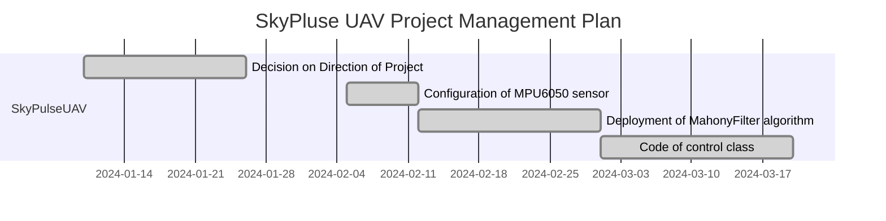

# SkyPulseUAV


[](https://github.com/Tony-Btian/SkyPulseUAV)
[](https://github.com/Tony-Btian/SkyPulseUAV)

> SkyPulseUAV: Pioneering UAV Technology for Critical Missions


## Welcome to the SkyPulseUAV Project

SkyPulseUAV is a groundbreaking real-time embedded system project, specifically designed to enhance the capabilities of unmanned aerial vehicles (UAVs) in critical scenarios such as fire detection, earthquake rescue, and terrain exploration. Our mission is to empower UAVs with unparalleled stability and precision, making them indispensable tools in emergency response and environmental analysis.


### Project Contributors

| Name | Role |
| ---- | ---- |
| Binhan Tian |  |
| Jianliang Wu | Designing and writing C++ codes on Raspberry Pi, fusing data from all sensors and deploying PID and Mahonyfilter algorithm. |
| Jiaxing Wang |  |
| Zhiyan Tong |  |
| Shilin Zhang |  |


### Project Highlights
- **Versatile Application Spectrum**: Optimized for high-stakes missions like fire detection, earthquake relief efforts, and comprehensive terrain surveys.
- **Real-Time Decision Making**: Features real-time data processing for immediate and accurate responses in dynamic environments.
- **Advanced Stability and Control**: Employs sophisticated algorithms to maintain UAV balance and manoeuvrability, even in adverse conditions.
- **Seamless Hardware Integration**: Designed for compatibility with diverse UAV platforms, enhancing their utility in various field applications.
- **Open Source Community Driven**: SkyPulseUAV thrives on collaborative innovation, inviting contributions from developers, engineers, and UAV enthusiasts worldwide.


### Visual Project Management Plan

If you can not see the text inside, please switch your brower to light mode.




### Be Part of the Change
We call on the global community to join us in advancing UAV technology for critical missions. Your expertise and insights are invaluable in evolving SkyPulseUAV to meet the challenges of today and tomorrow.


### Connect and Collaborate
Stay updated with our progress, engage in discussions, and explore collaboration opportunities by following our repository and joining our community.

Let's transform the landscape of emergency response and environmental analysis together with SkyPulseUAV!

# Project Development Planning
### Global
- [x] Build up the Github warehouse & README
- [x] Complete the basic environment development for the project by install the Rasbian OS for Raspberry Pi
- [x] Design the Hardware and Software
- [x] Buy electrical components for the project

### Binhan Tian
- [ ] 

### Jianliang Wu
- [x] Write the C++ code on Raspberry Pi
- [x] Debugging each sensor to make them work properly
- [x] Depoly Mahonyfilter algorithm to fuse data from gyroscope and accelerometer
- [x] Design the control algorithm and tune the PID parameters
- [x] Create easy-to-use cross compile environment for users

# Guide
### System Deployment
Click the link below to get detailed information about the source code.
#### 
[Code Document](https://shilinzhang1.github.io/)

## Sensors & Actuators
### Sensors
The list of used sensors is shown in Table 2.1.  
&nbsp;&nbsp;&nbsp;&nbsp;&nbsp;&nbsp;&nbsp;&nbsp;&nbsp;&nbsp;&nbsp;&nbsp;&nbsp;&nbsp;&nbsp;&nbsp;&nbsp;&nbsp;&nbsp;&nbsp;&nbsp;&nbsp;&nbsp;&nbsp;&nbsp;&nbsp;&nbsp;&nbsp;&nbsp;&nbsp;&nbsp;&nbsp;&nbsp;&nbsp;&nbsp;&nbsp;&nbsp;&nbsp;&nbsp;&nbsp;&nbsp;&nbsp;&nbsp;&nbsp;&nbsp;&nbsp;&nbsp;&nbsp;&nbsp;&nbsp;&nbsp;&nbsp;&nbsp;&nbsp;&nbsp;&nbsp;&nbsp;&nbsp;&nbsp;&nbsp;&nbsp;&nbsp;&nbsp;&nbsp;&nbsp;&nbsp;&nbsp;&nbsp;&nbsp;&nbsp;&nbsp;&nbsp;&nbsp;&nbsp;&nbsp;&nbsp;&nbsp;&nbsp;&nbsp;Table 2.1 Sensors Bill of Materials (BOM)
| Item | Component Name | Part Number | Description                                 | Quantity | Supplier          | Notes               |
|:----:|:--------------:|:-----------:|:-------------------------------------------:|:--------:|:-----------------:|:-------------------:|
|  1   | Barometer      | BMP180      | Atmospheric pressure and temperature sensor | 1 (pcs)  | Chip Supplier     | Altitude positioning|
|  2   | IMU Module     | MPU6050     | 3-axis gyroscope + 3-axis accelerometer     | 1 (pcs)  | Module Supplier   | Attitude control    |
|  3   | Compass        | GY-271      | Three-axis magnetic field sensor            | 1 (pcs)  | Chip Supplier     | Heading determination|
|  4   | Infrared Sensor| IR-SEN      | Short-range obstacle detection              | 4 (pcs)  | Sensor Supplier   | Collision avoidance |
|  5   | Ultrasonic Sensor| US-SEN    | Distance measurement                        | 1 (pcs)  | Sensor Supplier   | Accurate height control|
|  6   | Camera         | CAM123      | Video and still image capture               | 1 (pcs)  | Electronics Supplier | Visual navigation |

Datasheet link:  

The subsequent section provides a comprehensive description of the sensor.
- BMP180 Barometer  
  This barometric pressure sensor is used to measure atmospheric pressure, which can be translated into altitude measurements. For unmanned aerial vehicles (UAVs), it is a key component for altitude control and positioning.
- MPU6050 IMU Module  
  An integrated module with a 3-axis gyroscope and a 3-axis accelerometer, this device can detect the UAV's orientation and acceleration in three-dimensional space. It is critical for the UAV's attitude control and motion tracking.
- Gyroscope and Accelerometer Model GY-521 (MPU6050)  
  Angular velocity (gyroscope), with full-scale range options of ±250, ±500, ±1000, and ±2000 degrees per second.  
  Acceleration (accelerometer), with full-scale range options of ±2g, ±4g, ±8g, and ±16g.  
  Acceleration data can be read from the ACCEL_XOUT_H/L, ACCEL_YOUT_H/L, and ACCEL_ZOUT_H/L registers.  
  Angular velocity data can be read from the GYRO_XOUT_H/L, GYRO_YOUT_H/L, and GYRO_ZOUT_H/L registers.  
  GY-271 Compass: A three-axis magnetic field sensor based on the QMC5883L chip, used to measure the intensity of the Earth's magnetic field. It serves as the compass functionality for the UAV, aiding in determining its heading.  
- Infrared Sensor  
  Utilized to detect the presence of objects near the UAV, commonly used for obstacle avoidance and altitude maintenance.  
- Infrared Distance Sensor Model KY-032  
  Ultrasonic Sensor: Emits ultrasonic waves and receives their echoes to measure the distance between the UAV and the ground or other objects, used for obstacle avoidance and precise altitude control in low-altitude flight.  
- Ultrasonic Distance Detection Module HY-SRF05  
  Camera: Captures video or still images, which can be used for surveillance, mapping, or image recognition navigation.  

The construction of UAVs involves the meticulous arrangement of sensors to fulfill functional requirements. The BMP180 barometer is typically placed at the center of the UAV to mitigate the effects of airflow. The MPU6050 is often closely integrated with the flight controller for real-time adjustments of the UAV's flight attitude. The GY-271 compass should be situated in an area with minimal electromagnetic interference to ensure the accuracy of heading indications. Infrared and ultrasonic sensors are usually located on the underside or around the UAV for detecting and avoiding obstacles. The camera, as per necessity, may be mounted at the front, bottom, or other strategic locations to provide optimal viewing angles.

## SkyPulseUAV Environment Deployment
The Raspberry Pi, developed by the Raspberry Pi Foundation in the United Kingdom, is a high-performance single-board computer. Its small size and low cost have quickly made it a popular embedded device among DIY enthusiasts, makers, electronics enthusiasts, and professional developers.
#### 1. Raspberry Pi Software Setup
The Raspberry Pi has become a highly favored device among developers and electronics enthusiasts due to its scalability, functionality, and cost-effectiveness. It is suitable not only for beginners and students but also for professionals.
##### Raspberry Pi 4B PIN Layout
![[Pasted image 20240415005309.png]]

#### 2.Writing Raspberry Pi OS System
##### Preparation

| Hardware       | Software                                              |
| -------------- | ----------------------------------------------------- |
| SD Card        | Raspberry Pi system writing tool: Raspberry Pi Imager |
| SD Card Reader |                                                       |
##### System Writing
Connect the SD card to the computer using a card reader, open the Raspberry Pi writing tool, select the appropriate Raspberry Pi model and system, as well as the SD storage card. The system will prioritize selecting the most recently released Raspberry Pi OS, usually with a recommended system. Debian has better hardware support, so here we take Debian as an example.
![[Pasted image 20240415010201.png]]
Before burning, you can choose to configure the Raspberry Pi OS system in advance. Alternatively, you can enter the system and make settings after burning is complete.
![[Pasted image 20240415010231.png]]
Here, taking early system setup as an example, click on 'Edit Settings'.
![[Pasted image 20240415010314.png]]
1. Set Hostname: [Hostname]
2. Set Username and Password
3. Configure Wi-Fi: Here, the Wi-Fi list will not be displayed. You need to directly enter the SSID of the Wi-Fi (the name displayed in the Wi-Fi list).
4. Language and Timezone Settings

After completing the above settings, click on 'SERVICES', check 'Enable SSH service', and choose to log in using a password. The password here is the username and password set earlier.
![[Pasted image 20240415010430.png]]
Click 'Save' to begin writing the system.
![[Pasted image 20240415010454.png]]
After burning is complete, simply insert the SD card into the Raspberry Pi. Upon powering on, the system will initialize automatically.
If the system was configured in advance, it will directly enter the desktop.
If no prior setup was done, a simple system boot configuration will guide you into the desktop.
External display devices can be connected to the Raspberry Pi via HDMI.

*Note: Each system burning process will format the SD card, so it's important to back up the data on the SD card before burning.
##### System Upgrade
Once the system is loaded, enter the desktop. The Raspberry Pi desktop looks like this:"
![[Pasted image 20240415010608.png]]
The first thing to do after system installation is to upgrade the system. Open the terminal and type:
```
sudo apt-get update
sudo apt-get upgrade
```
*Note: If prompted with (Y/N) during the upgrade process, type Y and press Enter. The initial upgrade may take a considerable amount of time, so please be patient.

#### Remote Connection to Raspberry Pi
Connecting the Raspberry Pi to a screen via HDMI can be cumbersome, so you can connect to it remotely using remote desktop.
##### SSH Connection
SSH is an encrypted remote connection network protocol primarily used for remote management of systems and servers. SSH connections ensure secure and confidential data transmission between two devices through public key encryption. Once established, SSH executes commands via the command line, enabling remote control of the device, particularly when the target device is a Linux system.

There are two methods to enable SSH service on the Raspberry Pi:
1. Enabling SSH via the graphical interface.
2. Enabling SSH via the command line.
##### Enabling SSH via the graphical interface:
Click on 'Menu' ➡️ 'Preferences' ➡️ 'Raspberry Pi Configuration', as shown in the following figure:
![[Pasted image 20240415011325.png]]
Turn on the SSH switch, and it is recommended to turn all switches on.
![[Pasted image 20240415011349.png]]
##### configure via the command line
Enter the following in the terminal
```
sudo raspi-config
```
Select Interface Options -> SSH to enable SSH, as shown in the following figure:
![[Pasted image 20240415011706.png]]
To connect via SSH from another host, taking macOS system as an example (the instructions for Windows are the same), enter the following in the macOS terminal:
```
ssh username@ip_address
```
![[Pasted image 20240415011744.png]]
When prompted to establish the connection, type 'yes' and then press Enter. Next, enter the password to establish the SSH connection. The password is the same as the login password for the Raspberry Pi.
![[Pasted image 20240415011835.png]]
If the following screen appears during the connection process:
![[Pasted image 20240415011920.png]]
Then you need to input
```
ssh-keygen -R <Host_IP>
```
This is because the key received by the target device for the SSH connection request does not match the key stored on the device. For security reasons, SSH clients do not connect to hosts with mismatched keys by default. The above command is used to reconnect SSH, prompting the host to create a new key.

#### VNC Connection
VNC connection provides a visual remote desktop connection service, allowing developers to operate the Raspberry Pi directly through a graphical interface. To connect to the Raspberry Pi via VNC, you need to download VNC software: RealVNC.

*We have already enabled the VNC service when setting up the SSH connection. If the connection is unsuccessful, please check if the VNC service is enabled.
![[Pasted image 20240415012101.png]]

Simply enter the IP address of the Raspberry Pi, fill in the username and password, and you will be able to connect to the Raspberry Pi's remote desktop via VNC.
![[Pasted image 20240415012136.png]]

## SkyPulseUAV Communication Protocol Overview
### Introduction
This part provides a detailed overview of the communication protocol implemented in the SkyPulseUAV, an embedded system designed for unmanned aerial vehicle (UAV) control. The protocol governs the interaction between the ground control station and the UAV's onboard control system, ensuring precise maneuvering and real-time telemetry.

### Protocol Structure
The communication protocol for the SkyPulseUAV is structured to provide a robust and error-resistant framework:
- Prefix: A byte sequence signaling the beginning of a message.
- Data: The core message containing commands or telemetry information.
- Checksum: A redundancy check value for validating the integrity of the data.

### Packet Format
Data packets sent to and from the SkyPulseUAV follow this format:
- Prefix: [0x01], designating the start of a control packet.
- Data: A variable-length section carrying the command instructions or telemetry data.
- Checksum: A byte calculated to verify data consistency.

### Command Structure
The UAV responds to a set of predefined commands, each with a unique structure:
- Command ID: A byte that uniquely identifies the type of command being sent.
- Parameters: Sequences of bytes representing command arguments or settings.

### Communication Sequence
The sequence of communication over the SkyPulseUAV protocol is as follows:
- Connection Initiation: Ground control initiates the session by sending a request to the UAV's IP and port.
- Handshake: The UAV acknowledges the ground control's request, confirming a secure link.
- Data Exchange: Ground control dispatches structured packets containing control commands, while the UAV sends back telemetry data.
- Acknowledgment and Validation: Each packet received is acknowledged, and its integrity is verified through the checksum.
- Error Correction: Packets failing the integrity check trigger a retransmission request.
- Session Closure: The session can be safely terminated by a specific command sequence, after which the UAV disengages communication.

### Error Handling
The SkyPulseUAV protocol incorporates error handling protocols to address issues such as signal interference, packet loss, and data corruption. Automatic retransmission and robust security measures are in place to ensure reliable operation.

### Conclusion
The communication protocol is a cornerstone of the SkyPulseUAV's operational integrity, facilitating a secure and reliable interface for UAV control and telemetry feedback. This protocol is instrumental in maintaining the UAV's performance and safety standards in various flight conditions.

# Contact
If you want to talk about technical issues related to this project, please contact one of us:

Jianliang Wu: moxiasgabi@gmail.com

Binhan Tian: 

## License
MIT License Copyright (c) 2024 Binhan Tian
